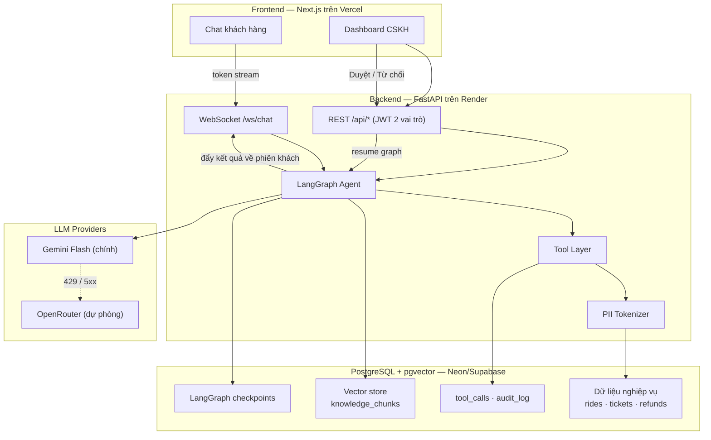

# Architecture — GSM-01

> 🎯 Trả lời câu hỏi *"Hệ thống vận hành ra sao?"*. Quyết định **vì sao** chọn cách này nằm ở
> `.ai/context/decisions.md`. Muốn biết *sửa X thì mở file nào* → `.ai/context/codemap.md`.
>
> ⚠️ Trạng thái: đây là kiến trúc **đã chốt ngày 2026-08-25**, phần lớn **chưa được hiện thực hoá**.
> Khi code xuất hiện, cập nhật lại file này cho khớp thực tế.

---

## 1. Sơ Đồ Tổng Thể



---

## 2. Vòng Đời Một Lượt Hội Thoại

```text
1. Khách gửi tin  →  WebSocket
2. Nạp memory     →  buffer N lượt + bản tóm tắt cuộn + hồ sơ khách
3. Router node    →  MỘT lần gọi LLM, structured output {intent, confidence, slots}
4. Rẽ nhánh theo intent (10 nhãn — xem docs/intent-taxonomy.md)
     ├─ policy.faq / fare.inquiry  →  RAG node  →  truy hồi pgvector  →  trả lời
     ├─ trip.lookup / booking.*    →  Tool node →  đọc/ghi DB qua PII Tokenizer
     └─ refund.request             →  Policy check  →  ngưỡng?
                                        ≤ ngưỡng  →  tự duyệt
                                        > ngưỡng  →  interrupt()  →  chờ CSKH
5. Guardrail đầu ra  →  quét PII lớp hai  →  stream token về khách
6. Ghi vết         →  messages · tool_calls · token usage
```

**Điểm dừng HITL**: khi `interrupt()` được kích hoạt, state graph được ghi vào bảng checkpoint.
Hội thoại của khách nhận thông báo "đang chuyển bộ phận xử lý". Khi CSKH bấm Duyệt trên dashboard,
API resume graph theo `thread_id`, graph chạy tiếp từ đúng node đó và đẩy kết quả về WebSocket của khách.

---

## 3. Ba Tầng Bảo Vệ (không tầng nào phụ thuộc vào việc LLM cư xử đúng)

| Tầng | Cơ chế | Chống được gì |
|---|---|---|
| Dữ liệu | PII token hoá trước khi vào context (ADR-004) | Rò rỉ SĐT / địa chỉ, kể cả qua prompt injection |
| Ghi dữ liệu | `idempotency_key` có ràng buộc `UNIQUE` (ADR-005) | Hoàn tiền / đặt xe trùng khi LLM gọi lại tool |
| Nghiệp vụ | Ngưỡng đọc từ `business_config`, không nằm trong prompt (ADR-006) | LLM tự ý duyệt vượt thẩm quyền |

---

## 4. Bộ Nhớ Hội Thoại (3 tầng)

| Tầng | Nội dung | Vòng đời |
|---|---|---|
| Ngắn hạn | N lượt gần nhất, nguyên văn | Trong phiên |
| Tóm tắt cuộn | Bản tóm tắt các lượt cũ, cập nhật mỗi N lượt | Trong phiên |
| Dài hạn | Hồ sơ khách: tên, hạng, chuyến gần đây, ticket đang mở | Vĩnh viễn, trong DB |

Mục tiêu kép: giữ ngữ cảnh qua lượt thứ 12+, đồng thời chặn context phình to làm vỡ ngưỡng 3 giây và
đội chi phí token.

---

## 5. Ngân Sách Độ Trễ (cho ràng buộc TTFT < 3s)

| Chặng | Ngân sách |
|---|---|
| Mạng + xác thực WebSocket | ~150ms |
| Nạp memory + hồ sơ khách | ~150ms |
| Truy hồi vector (nếu có) | ~200ms |
| Gọi LLM đến token đầu tiên | ~1.5s |
| Guardrail + đẩy token đầu | ~200ms |
| **Đệm dự phòng** | ~800ms |

**Ràng buộc thiết kế rút ra**: không được nối tiếp hai lần gọi LLM trên đường đi tới token đầu tiên.
Đây là lý do router trả structured output trong **một** lần gọi duy nhất.

---

## 6. Hạ Tầng

| Thành phần | Nơi chạy | Ghi chú |
|---|---|---|
| Frontend Next.js | Vercel | Gói free |
| Backend FastAPI | Render | Gói free ngủ sau ~15 phút không dùng → cần cảnh báo trước khi demo |
| PostgreSQL + pgvector | Neon hoặc Supabase | Một DB duy nhất (ADR-002) |
| LLM | Gemini Flash → OpenRouter | Chuyển provider tự động (ADR-001) |
