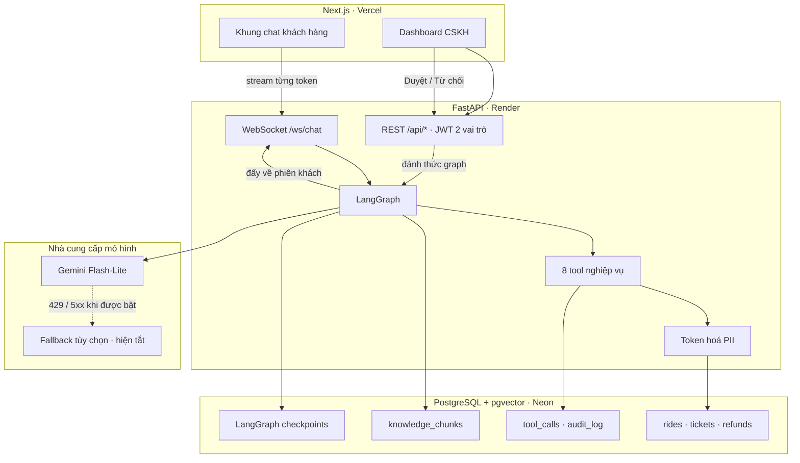

# GSM-01 — Trợ lý CSKH đặt xe & xử lý khiếu nại

AI Agent đa vai trò cho tổng đài dịch vụ gọi xe Xanh SM: tiếp nhận yêu cầu, phân loại ý định,
truy vấn dữ liệu chuyến đi thật, tra chính sách bằng RAG, gọi tool nghiệp vụ — và **dừng lại
xin phê duyệt của con người** khi thao tác vượt hạn mức rủi ro.

| Chỉ số | Ngưỡng đề bài | Đo được |
|---|---|---|
| Độ chính xác phân loại ý định | ≥ 90% | **97,5%** (79/81) |
| Thời gian phản hồi (p95 TTFT) | < 3 s | **1,47 s** |
| Rò rỉ PII trước 20 đòn tấn công | 0 | **0/20** |
| Truy hồi tri thức (recall@3) | — | **100%** (30/30) |
| Trả lời đúng số liệu qua hội thoại nhiều lượt | — | **100%** (8/8) |
| Trung thực với nguồn | — | **100%** |

Chạy lại toàn bộ bảng trên bằng một lệnh: `.venv/Scripts/python.exe -m eval.run_eval`

**Chạy thử**: [gsm-01.vercel.app](https://gsm-01.vercel.app) · `demo.customer@gsm.vn` hoặc
`agent01@gsm.vn` · mật khẩu `Demo@123`

---

## Kiến trúc



Vòng đời một lượt: `phân loại ý định → truy hồi tri thức → gọi tool → dựng câu trả lời → stream`.
Chi tiết ở [`.ai/context/architecture.md`](.ai/context/architecture.md).

---

## Bốn quyết định định hình hệ thống

**PII được token hoá TRƯỚC khi vào context của LLM.** Dữ liệu từ cơ sở dữ liệu đi qua một tầng
thay số điện thoại và địa chỉ bằng mã giữ chỗ. Model làm việc trên mã giữ chỗ; giá trị thật chỉ
hiện lại ở giao diện cho vai trò có quyền. *LLM không thể làm lộ thứ nó chưa từng nhìn thấy.*
Đo được: chỉ dặn trong prompt lộ 5/20, thêm lọc regex còn 2/20, token hoá thì 0/20.
→ [ADR-004](.ai/context/decisions.md)

**Mọi tool ghi dữ liệu đều có khoá chống trùng ở tầng cơ sở dữ liệu.** Đây là tầng bảo vệ duy
nhất không phụ thuộc vào việc mô hình cư xử đúng. Nó trả công đúng lúc làm HITL: khi graph chạy
tiếp sau phê duyệt, LangGraph chạy **lại cả node**, tức lệnh hoàn tiền được gọi lần thứ hai —
và bị chặn. → [ADR-005](.ai/context/decisions.md)

**Ngưỡng nghiệp vụ là dữ liệu, không nằm trong prompt.** Ngưỡng tự duyệt 50.000đ, cửa sổ huỷ
miễn phí, ngưỡng đi vòng 30% — tất cả nằm trong bảng `business_config`, đọc lúc chạy. Đổi ngưỡng
không phải sửa prompt và chạy lại toàn bộ bộ đo. → [ADR-006](.ai/context/decisions.md)

**Số tiền hoàn do hệ thống đối soát, không lấy theo lời khai của khách.** Khách thường không biết
mình được hoàn bao nhiêu, và để khách tự khai là mở đường cho gian lận. Hệ thống đọc log thanh
toán, lộ trình, phí đã thu để tự xác định — và **từ chối đúng** khi không đủ điều kiện.
→ [ADR-009](.ai/context/decisions.md)

Toàn bộ các quyết định kiến trúc, kèm các phương án đã loại và lý do:
[`.ai/context/decisions.md`](.ai/context/decisions.md)

---

## Công nghệ

| Tầng | Lựa chọn |
|---|---|
| Điều phối agent | LangGraph · checkpointer Postgres · `interrupt()` cho HITL |
| Mô hình | Gemini 3.5 Flash-Lite (chính) · fallback tùy chọn (hiện tắt) |
| Truy hồi | pgvector, 768 chiều, cắt đoạn theo tiêu đề |
| Backend | FastAPI · WebSocket streaming · JWT hai vai trò |
| Cơ sở dữ liệu | PostgreSQL 17 trên Neon — dữ liệu nghiệp vụ, vector, và checkpoint dùng chung một nơi |
| Frontend | Next.js 15 |
| Triển khai | Vercel (giao diện) · Render (backend) |

---

## Chạy ở máy

Yêu cầu: Python 3.11+, Node 20+, một PostgreSQL có `pgvector` (Neon là đủ).

```bash
# 1. Phụ thuộc
pip install uv
uv venv && uv pip install --python .venv/Scripts/python.exe -e ".[dev]"

# 2. Cấu hình — xem .env.example để biết từng biến làm gì
cp .env.example .env

# 3. Dựng cơ sở dữ liệu và nạp tri thức
.venv/Scripts/python.exe -m src.backend.db.apply_schema
.venv/Scripts/python.exe -m src.backend.db.seed
.venv/Scripts/python.exe -m src.backend.rag.indexer

# 4. Chạy
.venv/Scripts/python.exe run_dev.py          # backend — BẮT BUỘC dùng file này trên Windows
cd src/frontend && npm install && npm run dev # giao diện
```

> **Trên Windows phải dùng `run_dev.py`**, không gọi thẳng `uvicorn`: uvicorn chọn
> `ProactorEventLoop`, mà `psycopg` bản async không chạy được trên đó nên checkpointer của
> LangGraph sẽ hỏng mọi kết nối. Linux không gặp vấn đề này.

---

## Kiểm chứng

```bash
.venv/Scripts/python.exe -m pytest -q                    # 69 test
.venv/Scripts/python.exe -m eval.run_eval                # bảng 6 chỉ số, ~10 phút
.venv/Scripts/python.exe -m tests.test_e2e_slice         # 28 phép kiểm đầu-cuối
.venv/Scripts/python.exe -m tests.test_hitl_flow         # 26 phép kiểm luồng duyệt
.venv/Scripts/python.exe -m ruff check src/ tests/ eval/
```

Bộ đo là **bằng chứng của dự án**, không phải phụ kiện. Nó chia kết quả theo từng dạng đầu vào
tiếng Việt — không dấu, teencode, sai chính tả, trộn Anh–Việt, cảm xúc mạnh, prompt injection —
vì con số tổng hay che mất chỗ hỏng. Chi tiết: [`eval/README.md`](eval/README.md).

**Điểm yếu tự biết**: bộ dữ liệu kiểm thử do nhóm tự soạn. Các con số chứng minh hệ thống ổn định
trên những gì đã lường trước, chưa chứng minh nó ổn với người dùng thật.

---

## Tài liệu

| Bạn muốn biết | Đọc |
|---|---|
| Trình bày trong 5 phút | [`docs/DEMO.md`](docs/DEMO.md) |
| Tính năng và tiêu chí nghiệm thu | [`docs/PRD.md`](docs/PRD.md) |
| 10 nhãn ý định và ranh giới dễ nhầm | [`docs/intent-taxonomy.md`](docs/intent-taxonomy.md) |
| 14 bảng dữ liệu và 11 case khó cài sẵn | [`docs/DATA-MODEL.md`](docs/DATA-MODEL.md) |
| Triển khai và các bẫy đã biết | [`docs/DEPLOY.md`](docs/DEPLOY.md) |
| Vì sao làm theo cách này | [`.ai/context/decisions.md`](.ai/context/decisions.md) |
| Muốn sửa X thì mở file nào | [`.ai/context/codemap.md`](.ai/context/codemap.md) |
| Lỗi nào đã gặp và sửa ra sao | [`.ai/context/bug-history.md`](.ai/context/bug-history.md) |

Dự án dùng quy trình đa-agent: `AGENTS.md` là nguồn chân lý cho mọi AI agent làm việc trên
repo, `.ai/JOURNAL.md` ghi nhật ký từng phiên, `.ai/TASKS.md` ghi việc còn lại.
