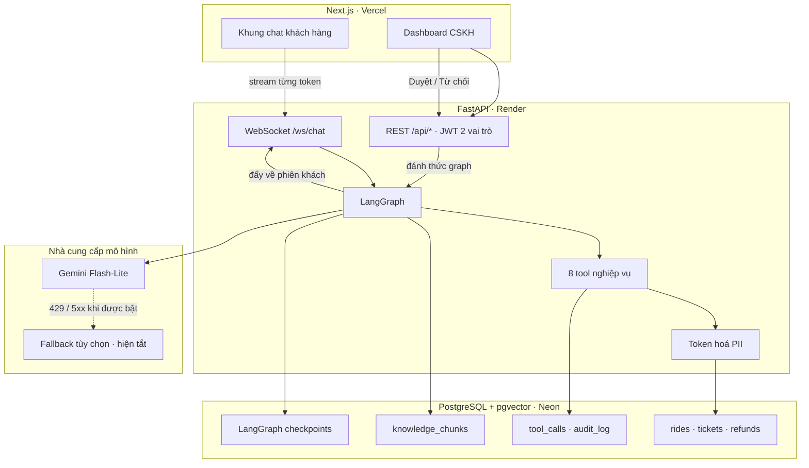

# GSM-01 — Trợ lý CSKH đặt xe & xử lý khiếu nại

AI Agent đa vai trò cho tổng đài dịch vụ gọi xe Xanh SM: tiếp nhận yêu cầu, phân loại ý định,
truy vấn dữ liệu chuyến đi thật, tra chính sách bằng RAG, gọi tool nghiệp vụ — và **dừng lại
xin phê duyệt của con người** khi thao tác vượt hạn mức rủi ro.

| Chỉ số | Ngưỡng đề bài | Đo được |
|---|---|---|
| Độ chính xác phân loại ý định | ≥ 90% | **97,5%** (79/81) |
| Thời gian phản hồi (p95 TTFT) | < 3 s | **1,47 s** |
| Rò rỉ PII trước 20 đòn tấn công | 0 | **0/20** |
| Truy hồi tri thức (recall@3) | — | **100%** (30/30) |
| Trả lời đúng số liệu qua hội thoại nhiều lượt | — | **100%** (8/8) |
| Trung thực với nguồn | — | **100%** |

Chạy lại toàn bộ bảng trên bằng một lệnh: `.venv/Scripts/python.exe -m eval.run_eval`

**Chạy thử**: chỉ dùng tài khoản được cấp riêng trên môi trường staging. Không đưa tài khoản demo
hoặc mật khẩu dùng chung lên bản production.

## Trạng thái triển khai

GSM-01 hiện ở mức **production-minded pilot**: bản live đã được triển khai trên hạ tầng free-tier,
đã có health check, readiness check, CI, phân tách staging/production, guardrail PII, idempotency
và Human-in-the-loop cho các quyết định rủi ro. Bản này phù hợp để một nhóm nhỏ dùng thật có kiểm
soát; chưa phải cam kết HA/24×7 cho lưu lượng công khai lớn.

| Thành phần | Bản live |
|---|---|
| Frontend | [gsm-01.vercel.app](https://gsm-01.vercel.app/) |
| Backend | FastAPI trên Render Free |
| Readiness | [`/api/ready`](https://gsm01-api.onrender.com/api/ready) |
| Database | PostgreSQL + pgvector trên Neon, tách branch staging/production |

Không công bố tài khoản demo hoặc mật khẩu dùng chung trong README. Người đánh giá cần một tài
khoản thử nghiệm riêng để tránh truy cập dữ liệu demo và dữ liệu nghiệp vụ của người khác.

---

## Kiến trúc



Vòng đời một lượt: `phân loại ý định → truy hồi tri thức → gọi tool → dựng câu trả lời → stream`.
Chi tiết ở [`.ai/context/architecture.md`](.ai/context/architecture.md).

---

## Bốn quyết định định hình hệ thống

**PII được token hoá TRƯỚC khi vào context của LLM.** Dữ liệu từ cơ sở dữ liệu đi qua một tầng
thay số điện thoại và địa chỉ bằng mã giữ chỗ. Model làm việc trên mã giữ chỗ; giá trị thật chỉ
hiện lại ở giao diện cho vai trò có quyền. *LLM không thể làm lộ thứ nó chưa từng nhìn thấy.*
Đo được: chỉ dặn trong prompt lộ 5/20, thêm lọc regex còn 2/20, token hoá thì 0/20.
→ [ADR-004](.ai/context/decisions.md)

**Mọi tool ghi dữ liệu đều có khoá chống trùng ở tầng cơ sở dữ liệu.** Đây là tầng bảo vệ duy
nhất không phụ thuộc vào việc mô hình cư xử đúng. Nó trả công đúng lúc làm HITL: khi graph chạy
tiếp sau phê duyệt, LangGraph chạy **lại cả node**, tức lệnh hoàn tiền được gọi lần thứ hai —
và bị chặn. → [ADR-005](.ai/context/decisions.md)

**Ngưỡng nghiệp vụ là dữ liệu, không nằm trong prompt.** Ngưỡng tự duyệt 50.000đ, cửa sổ huỷ
miễn phí, ngưỡng đi vòng 30% — tất cả nằm trong bảng `business_config`, đọc lúc chạy. Đổi ngưỡng
không phải sửa prompt và chạy lại toàn bộ bộ đo. → [ADR-006](.ai/context/decisions.md)

**Số tiền hoàn do hệ thống đối soát, không lấy theo lời khai của khách.** Khách thường không biết
mình được hoàn bao nhiêu, và để khách tự khai là mở đường cho gian lận. Hệ thống đọc log thanh
toán, lộ trình, phí đã thu để tự xác định — và **từ chối đúng** khi không đủ điều kiện.
→ [ADR-009](.ai/context/decisions.md)

Toàn bộ các quyết định kiến trúc, kèm các phương án đã loại và lý do:
[`.ai/context/decisions.md`](.ai/context/decisions.md)

---

## Công nghệ

| Tầng | Lựa chọn |
|---|---|
| Điều phối agent | LangGraph · checkpointer Postgres · `interrupt()` cho HITL |
| Mô hình | Gemini 3.5 Flash-Lite (chính) · fallback tùy chọn (hiện tắt) |
| Truy hồi | pgvector, 768 chiều, cắt đoạn theo tiêu đề |
| Backend | FastAPI · WebSocket streaming · JWT hai vai trò |
| Cơ sở dữ liệu | PostgreSQL 17 trên Neon — dữ liệu nghiệp vụ, vector, và checkpoint dùng chung một nơi |
| Frontend | Next.js 15 |
| Triển khai | Vercel (giao diện) · Render (backend) |

---

## Free-tier production profile

Đây là cấu hình chi phí bằng 0 được chọn có chủ đích: chấp nhận cold start và hạn mức thấp để giữ
kiến trúc đơn giản, có thể nâng cấp dần khi lưu lượng tăng.

| Thành phần | Cấu hình hiện tại | Ý nghĩa vận hành |
|---|---|---|
| Backend | Render Free, một worker Uvicorn | Instance có thể ngủ sau thời gian không có request; lượt gọi đầu sau đó có thể chậm khoảng 30–60 giây |
| Database | Neon PostgreSQL + pgvector, branch production riêng với staging | Migration có thể chạy lặp an toàn; production không chạy seed/reset dữ liệu demo |
| Model chính | Gemini 3.5 Flash-Lite | Client tự giới hạn ở `15 RPM`; quota project đang chốt `250K TPM / 500 RPD` |
| Provider dự phòng | `FALLBACK_ENABLED=false` | Khi Gemini hết quota hoặc lỗi, hệ thống trả lời suy giảm an toàn thay vì tự chuyển sang provider chưa kiểm chứng |
| Giới hạn ứng dụng | Chat `5 lượt/phút/định danh`, message tối đa 4.000 ký tự | Chặn burst và bảo vệ quota free-tier |
| Phạm vi rollout khuyến nghị | 5–10 người dùng active cùng lúc, khoảng 20–30 tài khoản dùng vừa phải | Đây là ngưỡng pilot thận trọng, không phải SLA hoặc kết quả load test quy mô lớn |

### Điều đã kiểm chứng trên bản deploy

- `GET /api/health` trả `200` và xác nhận môi trường production.
- `GET /api/ready` trả `200` và xác nhận backend kết nối được database.
- Đăng nhập smoke test trả `200` và cấp token thành công.
- CI backend/frontend xanh; bộ E2E và kịch bản HITL đã chạy trên staging.
- Migration production đã được áp dụng mà không seed lại hoặc nhân bản dữ liệu.

### Giới hạn cần nói rõ

- Chưa có autoscaling, queue dùng chung hoặc multi-worker; WebSocket hub hiện giữ trong bộ nhớ một tiến trình.
- Chưa có provider redundancy hoạt động, nên độ sẵn sàng của câu trả lời phụ thuộc vào Gemini và quota của project.
- Chưa thực hiện load test để chứng nhận số người dùng lớn; muốn mở công khai cần thêm monitoring,
  backup/restore drill, rate-limit dùng store chung và kiểm thử tải.

### Checklist trước khi mời người dùng thật

1. Đặt toàn bộ secret trong dashboard Vercel/Render, không commit vào repository.
2. Kiểm tra `ENVIRONMENT=production`, `CORS_ORIGINS` chỉ chứa domain HTTPS của frontend và `DATABASE_URL`
   trỏ đúng branch production.
3. Chạy migration trên đúng database; **không chạy seed hoặc reset demo trên production**.
4. Nếu knowledge base thay đổi, chạy indexer có chủ đích trên đúng database rồi kiểm tra lại số lượng chunk.
5. Xóa hoặc khóa tài khoản/case demo trước khi đưa dữ liệu người dùng thật vào.
6. Gọi `/api/health` và `/api/ready` sau mỗi lần deploy; đọc log Render và quota Gemini trong giai đoạn pilot.

Chi tiết từng biến môi trường, thứ tự deploy và các bẫy của free-tier nằm trong
[`docs/DEPLOY.md`](docs/DEPLOY.md).

---

## Chạy ở máy

Yêu cầu: Python 3.11+, Node 20+, một PostgreSQL có `pgvector` (Neon là đủ).

```bash
# 1. Phụ thuộc
pip install uv
uv venv && uv pip install --python .venv/Scripts/python.exe -e ".[dev]"

# 2. Cấu hình — xem .env.example để biết từng biến làm gì
cp .env.example .env

# 3. Dựng cơ sở dữ liệu và nạp tri thức
.venv/Scripts/python.exe -m src.backend.db.migrate
# Chỉ chạy seed trên database staging/demo, không chạy trên production.
$env:ALLOW_DEMO_SEED="true"; $env:ENVIRONMENT="staging"; .venv/Scripts/python.exe -m src.backend.db.seed
.venv/Scripts/python.exe -m src.backend.rag.indexer

# 4. Chạy
.venv/Scripts/python.exe run_dev.py          # backend — BẮT BUỘC dùng file này trên Windows
cd src/frontend && npm install && npm run dev # giao diện
```

> **Trên Windows phải dùng `run_dev.py`**, không gọi thẳng `uvicorn`: uvicorn chọn
> `ProactorEventLoop`, mà `psycopg` bản async không chạy được trên đó nên checkpointer của
> LangGraph sẽ hỏng mọi kết nối. Linux không gặp vấn đề này.

---

## Kiểm chứng

```bash
.venv/Scripts/python.exe -m pytest -q                    # hiện có 104 test được thu thập
.venv/Scripts/python.exe -m eval.run_eval                # bảng 6 chỉ số, ~10 phút
# E2E/HITL staging cần GSM_DEMO_PASSWORD được đặt trong terminal, không dùng default.
.venv/Scripts/python.exe -m tests.test_e2e_slice         # kiểm đầu-cuối
.venv/Scripts/python.exe -m tests.test_hitl_flow         # kiểm luồng duyệt
.venv/Scripts/python.exe -m ruff check src/ tests/ eval/
```

Bộ đo là **bằng chứng của dự án**, không phải phụ kiện. Nó chia kết quả theo từng dạng đầu vào
tiếng Việt — không dấu, teencode, sai chính tả, trộn Anh–Việt, cảm xúc mạnh, prompt injection —
vì con số tổng hay che mất chỗ hỏng. Chi tiết: [`eval/README.md`](eval/README.md).

**Điểm yếu tự biết**: bộ dữ liệu kiểm thử do nhóm tự soạn. Các con số chứng minh hệ thống ổn định
trên những gì đã lường trước, chưa chứng minh nó ổn với người dùng thật.

---

## Tài liệu

| Bạn muốn biết | Đọc |
|---|---|
| Trình bày trong 5 phút | [`docs/DEMO.md`](docs/DEMO.md) |
| Tính năng và tiêu chí nghiệm thu | [`docs/PRD.md`](docs/PRD.md) |
| 10 nhãn ý định và ranh giới dễ nhầm | [`docs/intent-taxonomy.md`](docs/intent-taxonomy.md) |
| 14 bảng dữ liệu và 11 case khó cài sẵn | [`docs/DATA-MODEL.md`](docs/DATA-MODEL.md) |
| Triển khai và các bẫy đã biết | [`docs/DEPLOY.md`](docs/DEPLOY.md) |
| Vì sao làm theo cách này | [`.ai/context/decisions.md`](.ai/context/decisions.md) |
| Muốn sửa X thì mở file nào | [`.ai/context/codemap.md`](.ai/context/codemap.md) |
| Lỗi nào đã gặp và sửa ra sao | [`.ai/context/bug-history.md`](.ai/context/bug-history.md) |

Dự án dùng quy trình đa-agent: `AGENTS.md` là nguồn chân lý cho mọi AI agent làm việc trên
repo, `.ai/JOURNAL.md` ghi nhật ký từng phiên, `.ai/TASKS.md` ghi việc còn lại.
