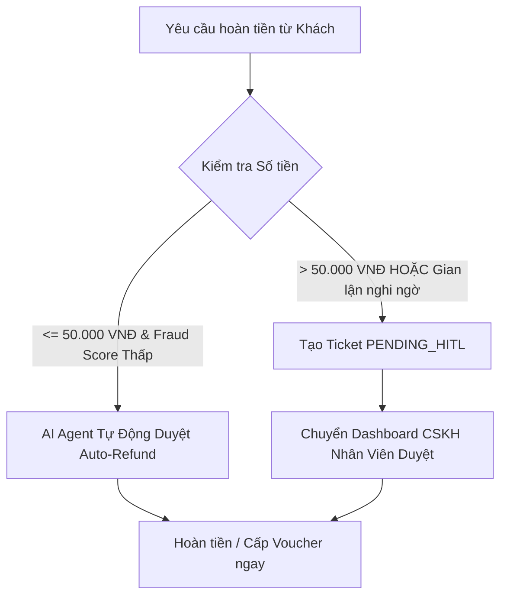

# 03. CHÍNH SÁCH HOÀN TIỀN & BỒI THƯỜNG (REFUND & COMPENSATION POLICY)
**Dịch vụ Áp dụng**: Toàn bộ dịch vụ vận tải hành khách Xanh SM  
**Phiên bản**: v2.4 (Cập nhật 2026)  
**Phạm vi thẩm quyền**: AI Agent tự động (Auto-Refund) & Nhân viên CSKH (Human-in-the-Loop)

---

## 1. Các Trường Hợp Đủ Điều Kiện Yêu Cầu Hoàn Tiền

Khách hàng được quyền yêu cầu hoàn tiền hoặc bồi thường trong các tình huống sau:

1. **Thu tiền trùng lặp (Double Charge)**:
   - Hệ thống trừ tiền thẻ/ví điện tử 2 lần cho cùng một mã chuyến đi (`ride_id`).
   - Khách đã thanh toán qua thẻ/ví thành công nhưng tài xế vẫn thu thêm tiền mặt khi xuống xe.

2. **Lộ trình bất thường do lỗi tài xế (Route Inefficiency)**:
   - Tài xế cố tình đi vòng vèo, sai lộ trình đề xuất của GPS dẫn đến quãng đường thực tế tăng trên **30%** so với lộ trình tiêu chuẩn (loại trừ trường hợp có thông báo kẹt xe, đường cấm hoặc khách hàng chủ động yêu cầu đổi lộ trình).

3. **Chênh lệch cước phí do lỗi hệ thống (Fare Discrepancy)**:
   - Giá tiền bị trừ thực tế cao hơn mức giá hiển thị lúc khách hàng bấm xác nhận đặt chuyến.

4. **Trừ phí hủy chuyến không đúng quy định**:
   - Khách hàng hủy hợp lệ trong 2 phút đầu hoặc do tài xế trễ chuyến nhưng vẫn bị hệ thống tính phí phạt.

5. **Trải nghiệm gián đoạn giữa đường**:
   - Xe gặp sự cố kỹ thuật, hết pin giữa đường mà tài xế không bố trí được xe hỗ trợ kịp thời.

---

## 2. Quy Định Phân Quyền Xử Lý: AI Tự Động vs. CSKH (Human-in-the-Loop)

Hệ thống CSKH Xanh SM áp dụng cơ chế phân quyền bảo mật 2 lớp:

### 2.1. Hạn Mức Tự Động Xử Lý Bởi AI Agent (Auto-Refund)
- **Điều kiện**:
  - Số tiền yêu cầu hoàn lại: **$\le$ 50.000 VNĐ**.
  - Tài khoản khách hàng có điểm uy tín cao (không có lịch sử khiếu nại hoàn tiền gian lận quá 2 lần trong 30 ngày gần nhất).
  - Có bằng chứng dữ liệu khớp lệnh trên hệ thống (ví dụ: Log thanh toán xác nhận trừ 2 lần, hoặc log GPS xác nhận hủy đúng giờ).
- **Hành động của AI**:
  - Tự động gọi tool `approve_refund(ride_id, amount, reason, auto=True)`.
  - Tiền được cộng lại vào Ví Xanh SM / chuyển hoàn phương thức gốc trong vòng 05 phút.
  - Gửi mã voucher bồi thường trực tiếp trong khung chat.

### 2.2. Hạn Mức Bắt Buộc Duyệt Bởi Con Người (Human-in-the-Loop - HITL)
- **Điều kiện bắt buộc chuyển CSKH**:
  - Số tiền yêu cầu hoàn lại: **> 50.000 VNĐ**.
  - Các vụ việc khiếu nại bồi thường thiệt hại tài sản (ví dụ: quần áo bị rách, hành lý bị ướt/hỏng).
  - Khách hàng khiếu nại gian lận cước số tiền lớn liên quan đến tài xế.
- **Hành động của AI**:
  - Thu thập đầy đủ thông tin: *Mã chuyến đi, số tiền chênh lệch, lý do chi tiết, ảnh chụp màn hình/bằng chứng (nếu có)*.
  - Tạo Ticket trên hệ thống với trạng thái `PENDING_HITL_APPROVAL` và độ ưu tiên `P1`.
  - Tạm dừng chuỗi hành động (Pause State) và phản hồi khách hàng: *"Yêu cầu hoàn tiền [X VNĐ] của Quý khách đã được chuyển tới Trưởng bộ phận CSKH để kiểm tra và đối soát. Chúng tôi sẽ phản hồi trong vòng tối đa 04 giờ làm việc."*
  - Dashboard CSKH nhận thông báo để nhân viên bấm **[Phê Duyệt]** hoặc **[Từ Chối]**.

---

## 3. Thời Gian Xử Lý & Hoàn Tiền Về Tài Khoản

| Phương thức thanh toán gốc | Thời gian hoàn tiền về tài khoản |
|---|---|
| **Ví Điện Tử (MoMo, ZaloPay, ShopeePay)** | 1 – 2 giờ làm việc (tối đa 24 giờ) |
| **Ví Xanh SM / Voucher bồi thường** | Tức thì (trong vòng 1 – 5 phút) |
| **Thẻ ATM Nội Địa (Napas / VNPAY)** | 3 – 5 ngày làm việc (không tính T7, CN & Lễ) |
| **Thẻ Tín Dụng Quốc Tế (Visa / Mastercard / JCB)** | 7 – 14 ngày làm việc (phụ thuộc ngân hàng phát hành thẻ) |

---

## 4. Biện Pháp Kiểm Soát Gian Lận (Anti-Fraud Guardrails)
- Mỗi tài khoản người dùng chỉ được hưởng chính sách Auto-Refund tối đa **02 lần / tháng**.
- Từ lần khiếu nại thứ 3 trở đi trong tháng, bất kể số tiền lớn hay nhỏ, AI Agent đều phải chuyển về hàng đợi kiểm tra thủ công của CSKH.
