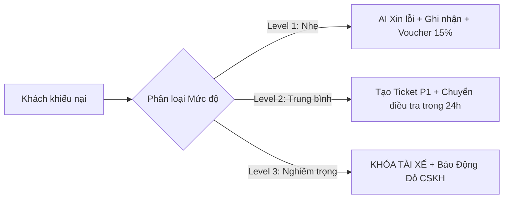

# 05. TIÊU CHUẨN DỊCH VỤ & XỬ LÝ KHIẾU NẠI TÀI XẾ (DRIVER CONDUCT & SAFETY)
**Dịch vụ Áp dụng**: Xanh SM Bike, Xanh SM Taxi (GreenCar), Xanh SM Luxury  
**Phiên bản**: v2.4 (Cập nhật 2026)  

---

## 1. Bộ Tiêu Chuẩn 5 Sao Của Tài Xế Xanh SM

Tất cả tài xế Xanh SM đều được đào tạo bài bản và phải tuân thủ nghiêm ngặt chuẩn mực dịch vụ:
1. **Tác phong & Đồng phục**: Mặc đồng phục áo xanh SM chỉn chu, đeo thẻ tên, đi giày, giao tiếp lịch sự *"Dạ, Xanh SM xin chào Quý khách!"*.
2. **Không gian xe điện VinFast**: Xe sạch sẽ, không mùi thuốc lá, không mùi hôi, máy lạnh mở ở nhiệt độ dễ chịu (22 - 25°C).
3. **Dịch vụ đẳng cấp (Đặc biệt dòng Luxury)**: Chủ động mở cửa xe cho khách hàng, hỗ trợ xếp hành lý vào cốp xe.
4. **An toàn giao thông**: Tuyệt đối không phóng nhanh vượt ẩu, không sử dụng điện thoại khi đang lái xe, không gọi điện thoại riêng gây ồn ào.
5. **Minh bạch cước phí**: Chạy đúng lộ trình ngắn nhất/tối ưu nhất của bản đồ, không tự ý vòi vĩnh thêm tiền boa/tiền thừa.

---

## 2. Phân Loại Mức Độ Khiếu Nại & Kịch Bản Phản Hồi Của AI Agent

AI Agent cần phân loại chính xác mức độ vi phạm để đưa ra phản hồi xoa dịu và gắn nhãn Ticket phù hợp:

### 2.1. Cấp Độ 1: Vi Phạm Nhẹ (Service Quality Issue)
- **Hành vi**:
  - Xe có rác nhẹ, điều hòa chưa đủ mát, mở nhạc quá to.
  - Tài xế ít nói, thái độ chưa niềm nở, không hỗ trợ vali nhẹ.
- **Quy trình xử lý của AI Agent**:
  - Gửi lời xin lỗi chân thành, chia sẻ với trải nghiệm chưa trọn vẹn của khách.
  - Ghi nhận thông tin vào hệ thống đánh giá chất lượng tài xế (trừ 5 điểm KPI phục vụ).
  - Tự động tặng ngay **Voucher 15% (tối đa 25.000 VNĐ)** vào ví khách hàng như một lời tạ lỗi.

### 2.2. Cấp Độ 2: Vi Phạm Trung Bình (Operational & Monetary Violation)
- **Hành vi**:
  - Tài xế cố tình đi đường vòng để câu cước.
  - Vòi vĩnh khách trả thêm tiền ngoài cuốc hoặc không trả lại tiền thừa.
  - Ép khách hủy chuyến hoặc từ chối chở khi khách đã có mặt tại điểm đón đúng giờ.
  - Chở quá số người quy định hoặc đón khách ngoài dọc đường.
- **Quy trình xử lý của AI Agent**:
  - Trấn an khách hàng và cam kết bảo vệ quyền lợi.
  - Gọi tool `create_support_ticket(category="DRIVER_MISCONDUCT", priority="MEDIUM")`.
  - Nếu có chênh lệch tiền cước: Đối soát GPS và hoàn trả phần tiền chênh lệch về tài khoản của khách.
  - Chuyển bộ phận Giám sát Đội ngũ Tài xế triệu tập tài xế giải trình trong 24 giờ.

### 2.3. Cấp Độ 3: Vi Phạm Nghiêm Trọng / Khẩn Cấp (Severe Safety & Harassment)
- **Hành vi**:
  - Tài xế có dấu hiệu say xỉn, sử dụng chất kích thích khi lái xe.
  - Lái xe nguy hiểm, lạng lách, xảy ra va chạm/tai nạn giao thông.
  - Có hành vi hoặc lời nói khiếm nhã, xúc phạm danh dự, đe dọa vũ lực hoặc quấy rối tình dục khách hàng.
  - Chiếm đoạt tài sản của khách hàng.
- **Quy trình xử lý KHẨN CẤP của AI Agent**:
  1. **Lập tức chuyển trạng thái Ticket thành `P0_CRITICAL`**.
  2. Kích hoạt lệnh **Khóa tạm thời tài khoản tài xế trên hệ thống** (`suspend_driver_account`) trong thời gian điều tra.
  3. Phản hồi khách hàng bằng thông điệp khẩn cấp: *"Xanh SM vô cùng xin lỗi về sự việc nghiêm trọng này. Chúng tôi đã lập tức đình chỉ hoạt động của tài xế và chuyển thông tin tới Trưởng bộ phận An toàn Khách hàng. Đội ngũ Chuyên trách sẽ gọi điện trực tiếp cho Quý khách trong vòng 15 phút tới. Nếu Quý khách cần hỗ trợ y tế hoặc an ninh khẩn cấp, vui lòng gọi Hotline 1900 2088 nhánh 1."*
  4. Bắn thông báo Realtime (WebSocket Alert) lên màn hình Dashboard CSKH để nhân viên trực ca lập tức can thiệp.
